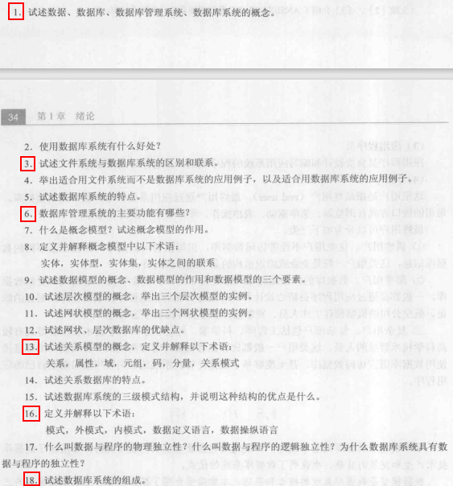

# 《数据库系统原理》第一章作业

## 1.1

数据（data）是数据库中存储的基本对象。描述事物的符号记录称为数据。

数据库（database）是长期储存在计算机内、有组织的、可共享的大量数据的集合。

数据库管理系统（DBMS）是位于用户与操作系统之间的一层数据管理软件。

数据库系统（DBS）是由数据库、数据库管理系统、应用程序和数据库管理员（DBA）组成的存储、管理、处理和维护数据的系统。

## 1.3

区别：文件系统的数据共享性差、冗余度大、独立性差、难以扩展。数据库系统的数据共享性好、冗余度小、独立性好、易扩展。

联系：数据库的底层仍然是与文件系统的交互

## 1.6

数据定义功能DDL；数据组织、存储和管理；数据操纵功能DML；数据库的事务管理和运行管理；数据库的建立和维护功能；其他功能

## 1.13

关系（relation）：一个关系通常对应一张表

属性（attribute）：表中的一列

域（domain）：一组具有相同数据类型的值的集合

元组（tuple）：表中的一行

码（key）：表中的某个属性组，可以唯一确定一个元组 

分量：元组中的一个属性值 

关系模式：对关系的描述，一般表示为`关系名(属性1,属性2,...,属性n)`

## 1.16

模式（schema）：也称逻辑模式，是数据库中全体数据的逻辑结构和特征的描述，是所有用户的公共数据视图。

外模式（external schema）：也称子模式（subschema）或用户模式，它是数据库用户（包括应用程序员和最终用户）能够看见和使用的局部数据的逻辑结构和特征的描述，是数据库用户的数据视图，是与某一应用有关的数据的逻辑表示

内模式（internal schema）：也称存储模式（storage schema），一个数据库只有一个内模式，它是数据物理结构和存储方式的描述，是数据在数据库内部的组织方式。

数据定义语言（DDL）：用户用来方便地对数据库中的数据对象的组成与结构进行定义的语言。

数据操纵语言（DML）：用户用来操纵数据（CRUD）的语言