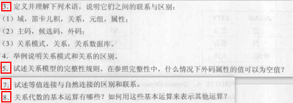

# 《数据库系统原理》第二章作业



## 2.3

（1）

域（domain）：一组具有相同数据类型的值的集合

笛卡尔积（cartesian product）：一种集合运算

关系（relation）：$D_1\times D_2\times\cdots D_n$的子集叫做在域$D_1,D_2,\cdots,D_n$上的关系，表示为$R(D_1,D_2,\cdots,D_n)$。n是关系的度（degree）

元组：关系表的每一行对应一个元组

属性：关系表的每一列对应一个属性

（2）

候选码（candidate key）：能唯一标识一个元组且其任何真子集不能的属性组

主码（primary key）：多个候选码中选定一个为主码

外码（foreign key）：如果公共关键字在一个关系中是主关键字，那么这个公共关键字被称为另一个关系的外键

（3）

关系：元组的集合

关系模式（relation schema）：关系的描述$R(U,D,DOM,F)$

关系数据库：所有关系的集合构成一个关系数据库/关系模式在某一时刻对应的关系的集合

## 2.4

实体完整性规则是指若属性A是基本关系R的主属性 ，则属性A不能取空值。若外键不是主属性，则可以取空值，反之不可以取空值。

## 2.5

关系模型有三类完整性约束：实体完整性（entity integrity）、参照完整性（referential integrity）和用户定义的完整性（user-defined integrity）

在外码属性值在另一个关系中没有对应值时可以为空值

## 2.7

联系：自然连接是一种特殊的等值连接

区别：自然连接要求比较的分量必须是同名的属性组，并且在结果中把重复的属性列去掉。

## 2.8

基本运算：并（union），差（except），笛卡尔积，选择（selection），投影（projection）

其他运算均可由这五种运算进行复合来实现。

## 附加题

设有三个关系：

- `S(sno,sname,sex,age)`学生(学号, 姓名,性别，年龄)
- `SC(sno,cno,grade)`选修课程(学号，课程号，成绩)
- `C(cno,cname,teacher)`课程(课程号，课程名，授课老师)

*注：性别用 ‘M’ 表示男， ‘F’ 表示女*

试用关系代数表达式表示下列查询语句：

1. 查询LIU老师所授课程的课程号和课程名。
2. 查询年龄大于23岁的男学生的学号和姓名。
3. 查询学号为S3学生所学课程的课程名与任课教师名。
4. 查询至少选修LIU老师所授课程中一门课程的女学生姓名
5. 查询WANG同学不学的课程的课程号。
6. 查询至少选修两门课的学生学号。
7. 查询全部学生都选修的课程的课程名和课程号。
8. 查询选修课程包含LIU老师所授全部课程的学生学号。

$$
(1)\Pi_{cno,cname}(\sigma_{teacher="LIU"}(C)) \\
(2)\Pi_{sno,sname}(\sigma_{age>23,sex='M'}(S)) \\
(3)\Pi_{cname,teacher}(\sigma_{sno="S3"}(SC\Join C)) \\
(4)\Pi_{sname}(\sigma_{sex='F'\and teacher="LIU"}(S\Join SC \Join C)) \\
(5)\Pi_{cno}(C)-\Pi_{cno}(\sigma_{sname="WANG"}(S\Join SC)) \\
(6)\Pi_{1}(\sigma_{1=4\and 2\ne5}(SC\times SC)) \\
(7)\Pi_{cno,cname}(C\Join (\Pi_{sno,cno}(SC)\div\Pi_{sno}(S))) \\
%(7)\Pi_{cname,cno}(\sigma_{COUNT(sno)>=|S|}(SC) \Join C) \\
(8)\Pi_{sno}(\sigma_{teacher="LIU"}(C)\Join S \Join SC)
$$

```sql
USE TEST;
CREATE TABLE S
(
   sno CHAR(9) PRIMARY KEY,
   sname CHAR(20) UNIQUE,
   sex CHAR(1),
   age SMALLINT
);
CREATE TABLE C
(
    cno CHAR(10) PRIMARY KEY,
    cname CHAR(4),
    teacher CHAR(10)
);
CREATE TABLE SC
(
   sno CHAR(9),
   cno CHAR(4),
   grade SMALLINT,
   PRIMARY KEY(sno,cno),
   FOREIGN KEY(sno) REFERENCES S(sno),
   FOREIGN KEY(cno) REFERENCES C(cno)
);
```

